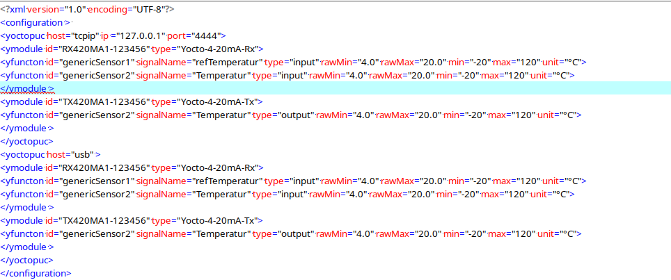

# iqPuzzle
Program to to handle the Boardgame

# DataRecorder

## Definitionen
- **Rohdate**: So, wie ein Signal am Sensor Eingang empfangen wird (**mA** oder **V**).
- **Messdate**: Daten mit physikalischen Einheiten (z.B. °C)

## Einleitung
Das Ziel dieses Projekts ist es einen Datenlogger mit einer Stromessung im 4-20 **mA** Bereich zu entwickeln. Die Rohdatenerfassung  soll nach der Projektspezifikation über 24 **h** lang mit einem (konfigurierbarem) Erfassungsintervall von 1 **s** bis mehrere **min** erfolgen. Als Erfassungshardware wird der Yocto-0-10V-Rx [9] von der schweizer Firma Yoctopuc [8] verwendet. Die Messdaten werden über einer konfigurierbare lineare Konversationfunktion in physikalische Grössen umgerechnet werden und in einem graphischen User Interface (GUI) dargestellt werden. Die aufgezeichneten Daten (Messwerte) soll neben der Darstellung auch auf Harddisk als CSV File abgespeichert werden. 

In einem weiteren Schritt soll das Projekt so erweitert werden, das aufgezeichneten Messwertdaten die als CSV Datei gelesen werden und über ein Yoctopuc[8] Emulator Modul [10] mit einem Strombereich von 4-20 **mA** ausgegeben werden. Der Verlauf der physikalischen Ausgabewerte soll im selben GUI, auf einem anderen Tab dargestellt werden.

Das Programm soll konfiguierbar 1-12 Messsensoren sowohl als Empänger als auch als Sender unterstützen. Als Konfigurationsdatei wird ein XML Format verwendet in dem die zu verwendenden Senoren und Emulatoren persisdent abgespeichert werden.

## Architektur
Die persistente Konfiguration wird in das Programm geladen `configuration.py`. In einem nächsten Schritt wird das GUI gestartet. In der verwendeten Model-View-Contoller Architectur fungiert das GUI als View-Controller Komponente das in konfigurierten Erfassungsinterval die Messdaten vom `producer.py`Python modul abholt. 

## Konfiguration

## Referenzen
1. „GitHub Flavored Markdown Spec“. https://github.github.com/gfm/#example-14 (zugegriffen 15. Januar 2023).
2. J. M. Willman, Beginning PyQt: A Hands-on Approach to GUI Programming with PyQt6, 2nd ed. Apress, 2022.
3. B. Okken, „Python Testing with Pytest: Simple, Rapid, Effective, and Scalable: Simple, Rapid, Effective, and Scalable : Okken, Brian: Amazon.de: Bücher“, 2022. 
4. E. Gamma, R. Helm, R. E. Johnson, und J. Vlissides, Design Patterns. Elements of Reusable Object-Oriented Software., 1st ed., Reprint Edition. Reading, Mass: Prentice Hall, 1997.
5. M. Fitzpatrick, „Create GUI Applications with Python & Qt5 (5th Edition, PyQt5): The hands-on guide to making apps with Python : Fitzpatrick, Dr Martin.
6. D. Beazley, Python Essential Reference, 4. Aufl. Upper Saddle River, NJ: Addison-Wesley Professional, 2009.
7. D. Bader, Python-Tricks: Praktische Tipps für Fortgeschrittene, 1. Aufl. Heidelberg: dpunkt.verlag GmbH, 2018.
8. [yoctopuc](https://www.yoctopuce.com/)
9. [Yocto-4-20mA-Rx](https://www.yoctopuce.com/EN/products/usb-electrical-interfaces/yocto-4-20ma-rx)
10. [Yocto-4-20mA-Tx](https://www.yoctopuce.com/EN/products/usb-electrical-interfaces/yocto-4-20ma-tx)